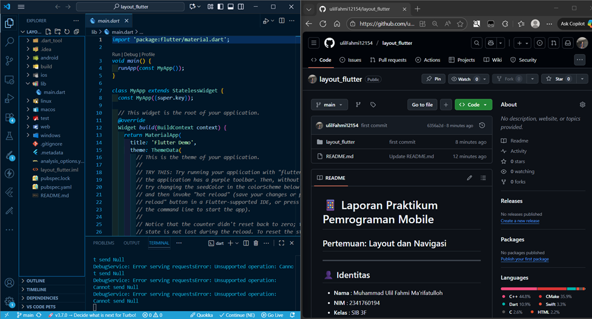

# 📱 Laporan Praktikum Pemrograman Mobile  
## Pertemuan: Layout dan Navigasi

---

## 👤 Identitas
- **Nama** : Muhammad Ulil Fahmi Ma'rifatulloh  
- **NIM** : 2341760194
- **Kelas** : SIB 3F 
- **Mata Kuliah** : Pemrograman Mobile  

---

## 📖 Tujuan Praktikum
1. Menerapkan jenis-jenis layout.
2. Menerapkan navigasi.
3. Menerapkan routing.   

---

## 🛠️ Alat dan Bahan
- **Hardware** : Laptop/PC dengan RAM minimal 8GB  
- **Software** :
  - Flutter SDK  
  - Android Studio / VS Code  
  - Emulator Android / Device Fisik  
- **Bahasa Pemrograman** : Dart  

---

## 📂 Langkah Praktikum
### Praktikum 1: Membangun Layout di Flutter
**Langkah 1:**
- Buat Project Baru

**Langkah 2:**
- Buka file lib/main.dart

**Langkah 3:**

**Identifikasi layout diagram**
- Identifikasi baris dan kolom.

  Struktur halaman dibangun menggunakan satu Column utama sebagai kerangka vertikal. Di dalamnya terdapat beberapa komponen:
  - Gambar utama ditempatkan di bagian paling atas sebagai satu widget terpisah.
  - Bagian judul disusun dalam sebuah Row yang terdiri dari:
    - Sebuah Column di sisi kiri berisi dua elemen teks.
    - Ikon berbentuk bintang di bagian tengah.
    - Teks angka “41” di sisi kanan.
  - Bagian tombol menggunakan Row yang memuat tiga Column, masing-masing berisi ikon dan teks di bawahnya.
  - Deskripsi panjang diletakkan di bagian bawah dalam sebuah Container yang berisi teks penjelasan.
- Apakah tata letaknya menyertakan kisi-kisi (grid)?
  - Tidak, tata letak halaman tidak memanfaatkan struktur kisi seperti GridView. Seluruh elemen ditata menggunakan perpaduan antara Column dan Row untuk menyusun konten secara vertikal dan horizontal.
- Apakah ada elemen yang tumpang tindih?
  - Tidak ada elemen yang saling menimpa satu sama lain, sehingga penggunaan Stack tidak diperlukan. Seluruh widget ditata secara linier, baik dalam arah vertikal maupun horizontal.
- Apakah UI memerlukan tab?
  - Antarmuka hanya mencakup satu layar sederhana tanpa fitur navigasi berbasis tab. Oleh karena itu, komponen seperti TabBar atau TabView tidak diperlukan dalam desain ini.
- Perhatikan area yang memerlukan alignment, padding, atau borders.
  - Alignment: Baris judul menggunakan pengaturan seperti MainAxisAlignment.spaceBetween agar ikon dan angka berada di posisi yang proporsional. Sementara itu, teks judul dalam Column diratakan ke kiri (start) untuk menjaga konsistensi tata letak.
  - Padding: Container yang memuat teks deskripsi diberi ruang dalam (padding) agar isi tidak menempel langsung ke sisi layar. Container pada bagian judul juga diberi padding di bagian bawah untuk menciptakan jarak dengan baris tombol di bawahnya.
  - Borders: Tidak ada garis pembatas (border) yang digunakan secara eksplisit. Sebagai gantinya, jarak antar elemen diatur melalui penggunaan padding dan spasi.

**Langkah 4:**
- Implementasi title row

